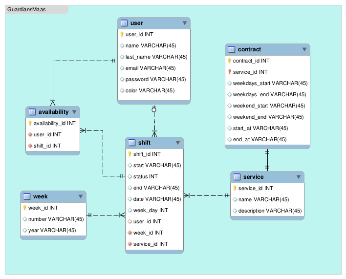

# Guardians MaaS - Shift Management System

Guardianes MaaS is a RESTful API application developed in Ruby on Rails 7 to manage the shifts of engineers who monitor critical services. This application allows users to register, log in, manage availabilities, and assign shifts in a balanced and efficient manner.
## Entity-Relationship Model (ER)
This is the model ER used for the project



## Getting Started.
These instructions will get you a copy of the project up and running on your local machine for testing purposes.

### Prerequisites.
You had to have installed the latest version of Ruby (3.0.0p0) and Ruby on rails (7.1.3.4).

```
gem install rails -v 7.1.3.4
```
### Installing.

1. **Clone the repository**:
    ```bash
    git clone git@github.com:jwaldimer/guardiansmaas.git
    cd guardiansmaas
    ```

2. **Install dependencies**:
    ```bash
    bundle install
    ```

3. **Set up the database**:
    ```bash
    rails db:create
    rails db:migrate
    ```
4. **Run the seeds to set the initial data for Weeks, Contracts, Services and Shifts**:
    ```bash
    rails db:seed
    ```
5. **Start the server**:
    ```bash
    rails s
    ```
6. **Access the application**:

    Navigate to `http://localhost:3000` to interact with the API.

### Authentication

This application uses JWT (JSON Web Tokens) for authentication and authorization. The Bearer tokes is provided before user Log in in the API. Make sure to include the token in the header of requests:

```http
Authorization: Bearer your_jwt_token_here
```
## API Endpoints

### 1. Create User (Signup)

**Endpoint**: `POST /signup`

**Request Body**:
```json
{
    "user": {
        "email": "test@test.com",
        "password": "password",
        "name": "Pedro",
        "last_name": "Picapiedra"
    }
}
```
### 2. Log In and Get Bearer Token

**Endpoint**: `POST /login`

**Request Body**:
```json
{
  "user": {
      "email": "test@test.com",
      "password": "password"
  }
}
```
The Bearer token will be return in headers

### 3. Get List of Weeks
Returns the list of weeks, beginning on the current week and 5 future weeks

**Endpoint**: `GET /api/v1/weeks`

### 4. Get List of Services
Get the list of services

**Endpoint**: `GET /api/v1/services`

### 5. Find and Return Shifts for a Specific Week and Service
Te week_id and service_id must be sended as query params

**Endpoint**: `GET /api/v1/shifts/find?week_id=294&service_id=13`

**Response**:
```json
{
    "status": {
        "code": 200,
        "message": "Datos retornados exitosamente."
    },
    "data": {
        "totals_by_users": [
            {
                "name": "Pedro Picapiedra",
                "total": 15,
                "color": "#4d6359"
            },
            {
                "name": "Sin asignar",
                "total": 38,
                "color": null
            }
        ],
        "shifts_by_days": [
            {
                "date": "Lunes 05 de agosto",
                "shifts": [
                    {
                        "id": 14433,
                        "start": 19,
                        "end": 20,
                        "status": "assigned",
                        "user_name": "Pedro Picapiedra",
                        "user_color": "4d6359"
                    }
                ]
            },
            {
                "date": "Martes 06 de agosto",
                "shifts": [
                    {
                        "id": 14484,
                        "start": 20,
                        "end": 21,
                        "status": "unassigned",
                        "user_name": null,
                        "user_color": null
                    }
                ]
            }            
        ]
    }
}
```

### 6. Register User Availabilities and Calculate Assignments

**Endpoint**: `POST /api/v1/availabilities`

**Request Body**:
```json
{
  "service_id": 16,
  "week_id": 347,
  "shifts_ids": [
      14433,
      14434
  ]
}
```

### 7. Get List of Shifts with Availabilities for Logged-In User
Te week_id and service_id must be sended as query params

**Endpoint**: `GET /api/v1/availabilities?week_id=347&service_id=16`

**Response**:
```json
{
    "status": {
        "code": 200,
        "message": "Datos retornados exitosamente."
    },
    "data": {
        "user": {
            "name": "Pedro Picapiedra",
            "color": "e0aa64"
        },
        "availability_per_shifts": [
            {
                "day": "Miércoles 07 de agosto",
                "shifts": [
                    {
                        "id": 14447,
                        "start": 23,
                        "end": 24,
                        "status": "assigned",
                        "is_available": true
                    },
                    {
                        "id": 14448,
                        "start": 19,
                        "end": 20,
                        "status": "unassigned",
                        "is_available": false
                    }
                ]
            }
        ]
    }
}
```

## Contribution
Contributions are welcome. If you would like to contribute, please open an issue or a pull request in the repository.
